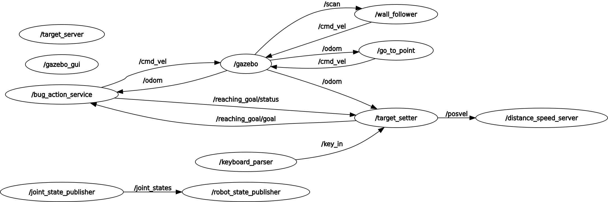

# Assignment 2
Mia La Rocca\
S6344889

## Components
```
├── action
│   └── Planning.action
├── CMakeLists.txt
├── launch
│   └── assignment2.launch
├── msg
│   └── PosVel.msg
├── package.xml
├── README.md
├── src
│   ├── distance_speed_server.cpp
│   ├── keyboard_parser.cpp
│   ├── target_server.cpp
│   └── target_setter.cpp
└── srv
    ├── DistanceSpeed.srv
    └── Target.srv

```

### Source Code
Four separate nodes were created for this assignment: the target setter, target server, distance speed server, and the keyboard parser.

#### Target Setter
The target setter is an action client to the bug action implemented in assignment_2_2023. The target setter reads in clicked points (```/clicked_point```) from rviz and then sends them to the action server as the goal point. The target setter also listens to the ```/key_in``` topic to get the input from stdin to either set or cancel a target. The target setter listens to the feedback from the server and prints to the console if the state has changed. The target server also subscribes to the ```/odom``` and converts those messages to the custom PosVel messages and publishes them on the ```/posvel``` topic.

#### Target Server
When called the target server looks up the target position from the ros parameters "des_pos_x" and "des_pos_y" and then publishes them.

#### Distance Speed Server
The distance speed server subscribes to the /posvel topic. Every time it receives a posvel message, calls the target server to get the target position. Then it updates its internal storage with the distance of the robot from the target and the average speed. The window used to calculate the average speed is set by the parameter ```avg_window_size```. When the service is called, it returns the distance and average speed.

#### Keyboard Parser
The keyboard parser reads in the std input and publishes it to the ```/key_in``` topic. This is a separate module from the target setter so it can use blocking functions to read the input and not disturb anything else. 

### Action
The action folder includes the file that describes the communication between the action client and the action server. This was copied over from the assignment_2_2023 repo.
### Launch
The launch folder includes a launch file that launches the simulation environment, provided action server, and the four nodes created for this assignment.
### Messages
A new custom message was created to describe the robots motion.\
PosVel.msg:\
&ensp;&ensp;x (float64): x position of the robot\
&ensp;&ensp;y (float64): y position of the robot\
&ensp;&ensp;vel_x (float64): linear speed of the robot in the x direction\
&ensp;&ensp;vel_z (float 64): angular speed of the robot in the z direction
### Services
Two service messages were created. One takes no arguments as a request and returns the target's x and y position. The second takes no arguments as a request and returns the robot's distance from the target and its average linear speed.

Target.srv:\
Request:\
&ensp;&ensp;[None]\
Response:\
&ensp;&ensp;target_x (float64): x position of the target\
&ensp;&ensp;target_y (float64): y position of the target

DistanceSpeed.srv:\
Request:\
&ensp;&ensp;[None]\
Response:\
&ensp;&ensp;distance (float64): distance between robot and target\
&ensp;&ensp;average_speed (float64): average speed of the robot (taken with a parameter defined window size)

## RQT Graph


## Target Setter Pseudocode
Because the target setter uses many callbacks, it is difficult to create a directional flow. Instead I will write pseudocode for the main function and each of the callback functions.

### Main

```
Initialize ros node
Create Action client

Create subscriber to /clicked_point with callback clicked_point_callback
Create subscriber to /odom with callback odom_callback
Create subscriber to /key_in with callback key_callback
Create publisher to /posvel

Wait for action server
Display instructions for setting target

spin
```
### doneCb (Action Client)
```
Print finish state
Display instructions for setting target
```

### activeCb (Action Client)
```
Print that goal went active
```

### feedbackCb (Action Client)
```
if (current action state is not previous action state)
    print state and position
    previous action state = current action state
```
### clicked_point_callback
```
cancel all action server goals
set goal x, y to equal clicked point x, y
publish new goal to action server
```
### odom_callback
```
create posvel message object
assign posvel.x to equal odom x
assign posvel.y to equal odom y
assign posvel.vel_x to equal odom linear x velocity
assign posvel.vel_z to equal odom angular z velocity
publish posvel to the /posvel topic
```
### key_callback
```
if the first character of the message is 'x' or 'X'
  cancel all action server goals
else if the first character of the message is 'T'
  parse the message to get the x, y
  cancel all action server goals
  publish new goal position
else 
  print bad input
```


## Operating Instructions

### Launching

In your catkin workspace, run catkin_make. Then launch the following
```
roslaunch r1_assignment_2 assignment2.launch
```
Check that you can see the laser scan in rviz. If not, replace the robot2_laser.gazebo file with the one in the melodic_laser branch of the robot_description repo.

### Setting Targets

To indicate a target for the robot, click the publish point in rviz and then click on the grid. Currently rviz only allows the user to click on the grid. A point will only be published if there is a small orange symbol next to the cursor when clicking on the grid. To expand the grid in rviz to the full size of the environment, set the grid plane cell count parameter to 18. 

A target can also be indicated by typing its coordinates as 'T:[x],[y]' + Enter (e.g. T:4.5,6.3) in the console window that you launched from. 

To cancel a target type an 'x' or 'X' into the console window that you launched from.

### Using the Target Server
```
rosservice call /get_target
```
### Using the Distance Speed Server
```
rosservice call /get_distance_speed
```
## Possible Improvements

This first possible improvement woud be adding a map to the rviz window so the user can see the map of the environment when picking their desired target point. The distance server also currently needs to store the whole window size worth of speeds. If the way the average was calculated was changed to ```avg(t) = (1-alpha)avg(t-1) + alpha * speed(t)```, then only the aveage would need to be stored and the alpha parameter can be used similar to the window size.

Right now the for the keyboard input is rather rudimentary. If the user inputs a capital T and then doesn't put the position in, it does not raise a bad input error. The goal position is kept the same but sent again as a new goal.

Also someitmes the robot accelerates so fast that it does a wheelie. This should be  avoided as once it got stuck in a wheelie on the wall and could not move out of that position.